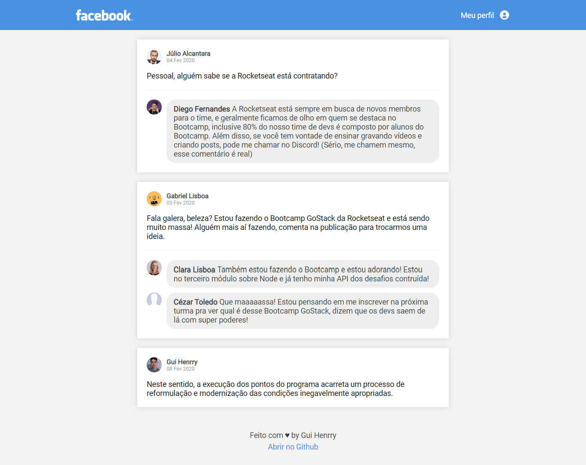

<h1 align="center">
    
</h1>

<h3 align="center">
  Desafio 4: Introdução ao React
</h3>

## :rocket: Sobre o desafio

Interface semelhante ao Facebook utilizando React.



## :information_source: Como utilizar em 4 passos

```bash
# Clone o repositório
$ git clone https://github.com/Guihenrry/facebook-clone.git

# Entre na pasta do repositório
$ cd facebook-clone

# Instalar dependencias
$ yarn

# Execute o projeto
$ yarn dev
```

Feito com ♥ by Gui Henrry ✌